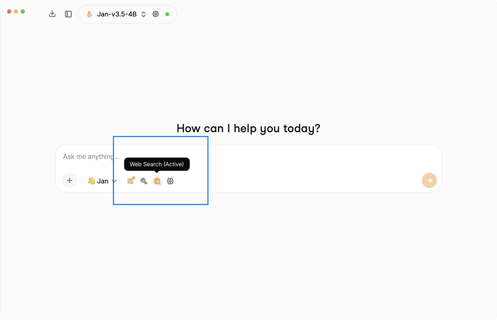
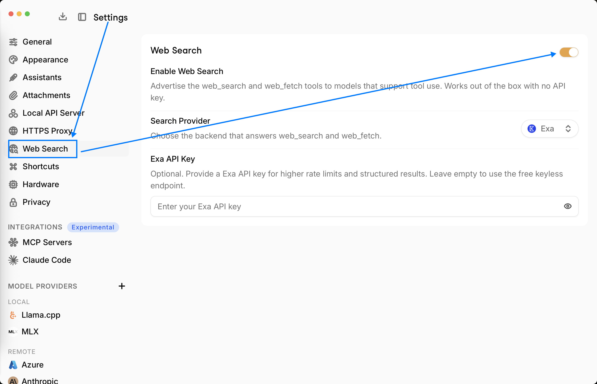

import { Callout } from 'nextra/components'

# Web Search

Jan has **built-in web search**. When enabled, Jan advertises two tools - `web_search` and
`web_fetch` - to any model that supports tool use, so the model can look up current information and
read web pages on its own. It works out of the box with **no API key** and **no MCP server** required.

<Callout type="info">
Web Search is **on by default**. The default provider (Exa) uses a free, keyless endpoint, so you can
start asking about current events right away - no setup needed.
</Callout>

You can toggle web search for a chat from the input toolbar - the globe icon shows **Web Search (Active)** when it's on.

## The two tools

| Tool | What it does |
|------|--------------|
| **`web_search`** | Searches the web and returns a ranked list of results (title, URL, snippet, and optional publish date). |
| **`web_fetch`** | Fetches a web page by URL and returns its readable text content, along with the source URL and title. |

A typical flow is `web_search` to find sources, then `web_fetch` to read a specific result in full.
`web_search` takes a `query` and an optional `count` (default 5, max 20); `web_fetch` takes an
http(s) `url`. Fetched content is length-bounded so it doesn't flood the model's context.

## Requirements

Web search only works with a model that supports **tool use**. The tools are advertised only to
tools-capable models, so pick a model that shows the **tools** capability in the model picker (most
local tool-calling models and the major cloud models qualify). If your model can't call tools, the
web tools won't be available.

## Configure it

Open **Settings > Web Search**.

### Enable Web Search

Toggles whether the `web_search` and `web_fetch` tools are advertised to models that support tool
use. On by default. Works with no API key.

### Search Provider

Choose the backend that answers `web_search` and `web_fetch`. Three providers are available:

| Provider | API key | Notes |
|----------|---------|-------|
| **Exa** (default) | Optional | Uses a free, keyless endpoint out of the box. Add a key for higher rate limits and structured results. |
| **Tavily** | Required | Needs a [Tavily](https://tavily.com) API key to return results. |
| **SearXNG** | Optional | Self-hosted. Point Jan at your own [SearXNG](https://searxng.org) instance URL (with the JSON API enabled). |

### Exa API Key (optional)

With Exa selected, an API key is **optional** - leave it empty to use the free keyless endpoint.
Providing an [Exa](https://exa.ai) API key gives you higher rate limits and structured results.

<Callout type="info">
For **Tavily**, an API key is required. For **SearXNG**, you provide your instance's base URL instead
of a key. The settings panel shows the right field for whichever provider you pick.
</Callout>

## How it relates to MCP search

This built-in web search is **native** - it does not use the [Model Context Protocol](/docs/desktop/mcp).
Earlier versions of Jan relied on an Exa (or Serper) MCP server for web search; that's no longer
necessary. You can still connect an MCP-based search server if you want a specific provider or extra
control, but for most users the built-in Web Search is all you need.
